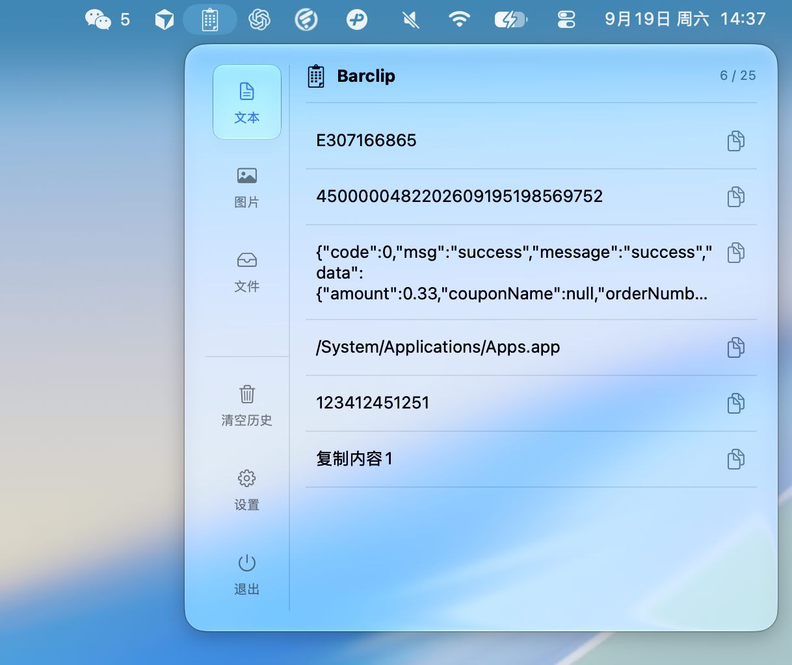
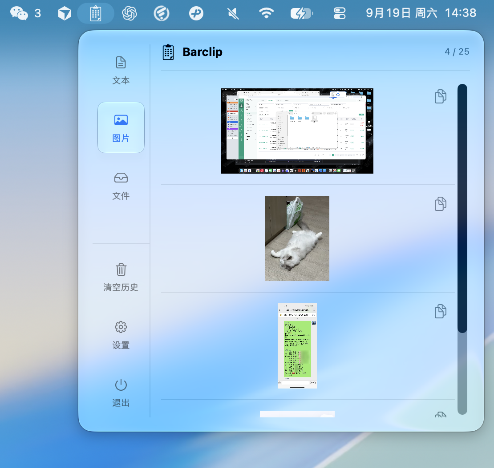
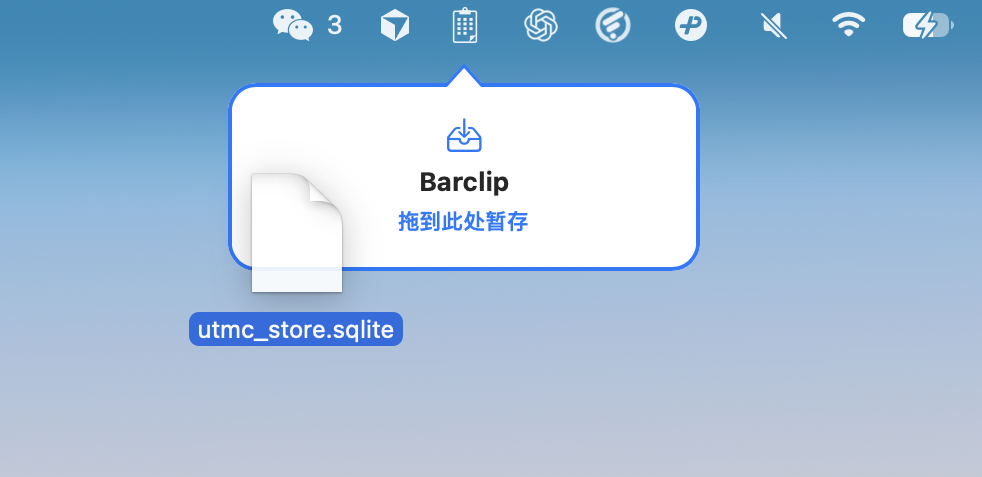
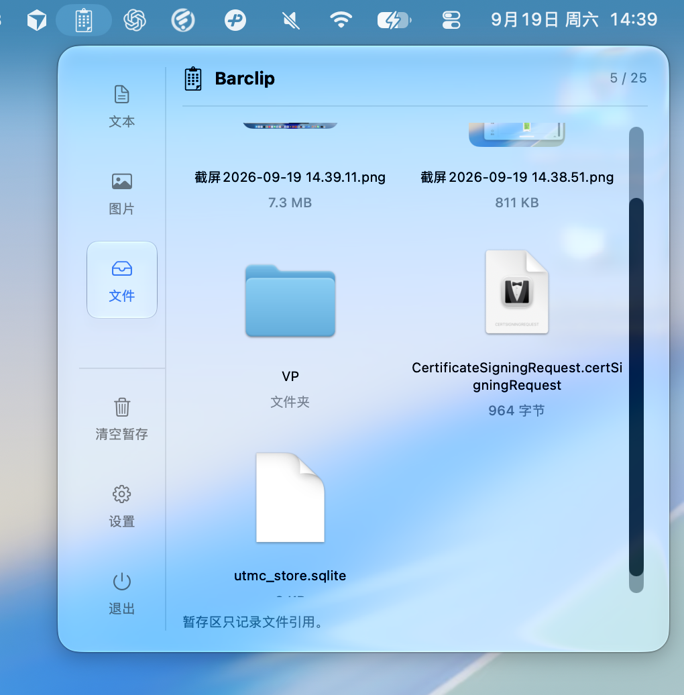

<p align="center">
  <a href="http://barclip.site/">
    
  </a>
</p>

<h1 align="center">Barclip</h1>

<p align="center">
  <strong>原生、轻量、注重隐私的 macOS 菜单栏剪贴板工具</strong><br>
  集中管理文本、图片与临时文件，让常用内容随手可取。
</p>

<p align="center">
  
  
  
  
</p>

<p align="center">
  <a href="http://barclip.site/"><strong>产品主页</strong></a>
  ·
  <a href="https://github.com/chenyuntaot/Barclip">GitHub</a>
  ·
  <a href="https://gitee.com/chenyuntao-0123/barclip">Gitee</a>
  ·
  <a href="docs/development.md">开发文档</a>
  ·
  <a href="docs/architecture.md">架构说明</a>
</p>

<p align="center">
  
</p>

## Barclip 是什么

Barclip 是一款专为 macOS 设计的菜单栏工具。它在后台整理最近复制的文本和图片，也提供独立的文件暂存区。需要复用内容时，无需反复切换窗口或查找原文件，只要打开菜单栏面板即可快速取用。

- **原生体验**：使用 Swift 与 SwiftUI 构建，遵循 macOS 的界面和交互习惯。
- **内容分类**：文本、图片和文件分区管理，历史记录清晰直观。
- **操作直接**：点击历史记录即可重新写入剪贴板；文件支持拖入、拖出、预览与打开。
- **隐私优先**：不上传剪贴板内容，不发起网络请求，数据处理全部在本机完成。

## 功能亮点

### 文本与图片历史

文本和图片分别记录、独立计数。多行文本、中文、Emoji 和原始空白格式均会保留；图片以缩略图浏览。点击图片会重新复制并显示选中效果，随后可按空格打开预览。

<p align="center">
  
  <br><sub>图片历史与缩略图浏览</sub>
</p>

### 文件暂存

把文件拖向 Barclip 菜单栏图标，即可放入临时暂存区。Barclip 只保存文件引用，不移动或删除原文件；从暂存区拖出时会生成副本，并支持空格预览和双击打开。

<table>
  <tr>
    <td width="50%" align="center">
      
      <br><sub>拖动过程中快速唤出暂存入口</sub>
    </td>
    <td width="50%" align="center">
      
      <br><sub>以网格方式管理暂存文件</sub>
    </td>
  </tr>
</table>

### 更顺手的日常体验

- 相同文本、图片或文件再次出现时自动去重并置顶。
- 每个分类可保留 10、25、50、100 或 200 条记录。
- 支持“退出后清空”和“重启后保留”两种保存策略。
- 可选择登录 Mac 时自动启动 Barclip。
- 支持简体中文和英文，并跟随系统语言切换。
- 常驻菜单栏，不占用 Dock 空间。

## 快速开始

### 系统要求

- macOS 14 或更高版本
- Xcode（从源码构建时需要）
- 无第三方运行依赖

首次读取剪贴板时，如果 macOS 显示访问提示，请根据需要授权。

### 获取 Barclip

- 访问 [Barclip 产品主页](http://barclip.site/) 了解产品与发布信息。
- 从 [GitHub](https://github.com/chenyuntaot/Barclip) 或 [Gitee](https://gitee.com/chenyuntao-0123/barclip) 获取项目源码。

### 从源码运行

用 Xcode 打开 `ClipboardHistory.xcodeproj`，选择 `ClipboardHistory` scheme，并以 **My Mac** 为运行目标。也可以在项目根目录执行：

```sh
xcodebuild -project ClipboardHistory.xcodeproj -scheme ClipboardHistory \
  -configuration Debug -derivedDataPath build build CODE_SIGNING_ALLOWED=NO
open build/Build/Products/Debug/Barclip.app
```

构建产物为 `Barclip.app`。只有修改 `project.yml` 后才需要运行 `xcodegen generate`。

## 使用方法

1. 在任意应用中复制文本或图片；系统截图进入剪贴板后也可被记录。
2. 点击菜单栏中的 Barclip 图标，在“文本”或“图片”分类中找到需要的内容。
3. 点击记录将其重新写入系统剪贴板，再回到目标应用使用 `⌘V` 粘贴；图片被选中后可按空格预览。
4. 将文件拖向菜单栏图标进行暂存；在“文件”分类中可拖出副本、空格预览或双击打开。
5. 在设置中调整历史容量、保存策略和“登录时打开”。

“清空历史”只删除当前分类在 Barclip 中的记录，不会修改系统剪贴板；“清空暂存”只删除文件引用，不会删除原文件。

## 数据与隐私

Barclip 不包含云同步或远程服务，剪贴板内容不会离开当前 Mac。

| 保存策略 | 行为 |
| --- | --- |
| 退出后清空（默认） | 历史仅在本次运行期间保留，退出应用后清空 |
| 重启后保留 | 历史保存在 `~/Library/Application Support/Barclip/`，下次启动时恢复 |

持久化数据未加密；删除应用不会自动删除上述目录。如需彻底移除历史，请在退出 Barclip 后手动删除该目录。

## 开发与测试

项目采用 Swift 6、SwiftUI、Observation 与 Swift Concurrency，主界面通过 `MenuBarExtra` 提供。详细模块划分和技术决策请参阅 [架构说明](docs/architecture.md)。

运行测试：

```sh
xcodebuild -project ClipboardHistory.xcodeproj -scheme ClipboardHistory \
  -derivedDataPath build -destination 'platform=macOS' test CODE_SIGNING_ALLOWED=NO
```

测试使用独立剪贴板、模拟数据和临时目录，不读取真实剪贴板，也不修改生产缓存。当前实现状态、验证记录与待手动验收项请参阅 [开发文档](docs/development.md)。

## 已知限制

- 约 500ms 内连续复制多个内容时，中间值可能被跳过。
- 图片仅收录剪贴板中的 PNG、TIFF 和 JPEG 位图。
- 文件暂存只保存原文件位置；原文件被移动或删除后，暂存项可能失效。
- 单条文本上限为 1 MiB，单张图片上限为 30 MiB。
- 暂不提供搜索、收藏、全局快捷键、云同步和自动粘贴。
- 当前源码构建未配置公开分发所需的 Developer ID 签名与 Apple 公证。

## 项目信息

| 项目 | 地址 |
| --- | --- |
| 产品主页 | [barclip.site](http://barclip.site/) |
| GitHub | [github.com/chenyuntaot/Barclip](https://github.com/chenyuntaot/Barclip) |
| Gitee | [gitee.com/chenyuntao-0123/barclip](https://gitee.com/chenyuntao-0123/barclip) |
| 开发者 | 陈云涛 |
| 联系邮箱 | [chenyuntao0123@icloud.com](mailto:chenyuntao0123@icloud.com) |

© 2026 Yuntao Chen
