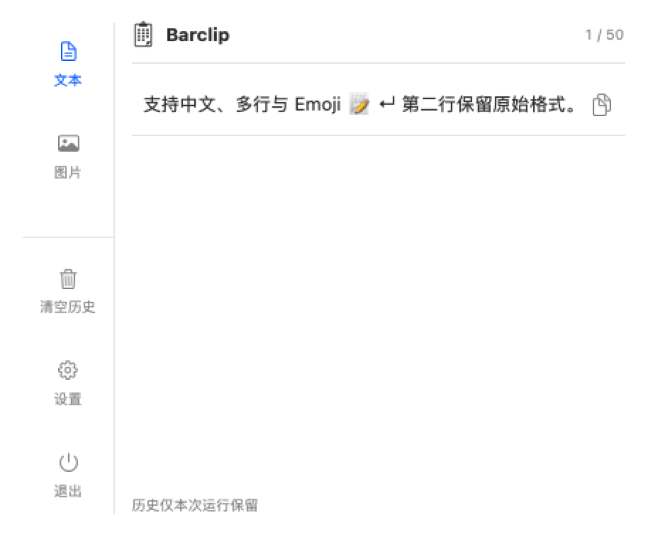

<p align="center">
  
</p>

<h1 align="center">Barclip</h1>

<p align="center">
  驻守菜单栏的 macOS 剪贴板历史<br>
  记录文本和图片，点击即可重新复制。
</p>

<p align="center">
  
  
  
  
</p>

<p align="center">
  <a href="https://github.com/chenyuntaot/Barclip">GitHub</a>
  ·
  <a href="docs/development.md">开发文档</a>
  ·
  <a href="docs/architecture.md">架构说明</a>
</p>

<p align="center">
  
</p>

## 功能

- **菜单栏常驻** — 不占用 Dock，点图标即可打开面板。
- **文本与图片** — 左侧切换两份独立历史；系统截图进入剪贴板后会记入图片。
- **文件暂存** — 从访达或桌面拖入只记下位置；再拖出时复制一份，原件保留。空格预览，双击打开。
- **一键再复制** — 点击文本或图片记录写回系统剪贴板，到目标应用用 ⌘V 粘贴。
- **去重置顶** — 相同文本或相同 PNG 再次复制时移到顶部。
- **容量可调** — 10 / 25 / 50 / 100 / 200 条，文本和图片各自计数，默认 50。
- **两种保存策略** — 退出后清空（默认），或重启后保留（保存在 `~/Library/Application Support/Barclip/`，删除应用后仍保留）。
- **本机完成** — 不上传剪贴板内容，没有网络请求。
- **中文 / English** — 界面跟随 macOS 系统语言，只提供简体中文和英文。

## 要求

- macOS 14 或更高版本
- Xcode（用于构建）
- 无需第三方运行依赖

首次复制时，如系统询问剪贴板访问权限，请按需要允许。

## 运行

打开 `ClipboardHistory.xcodeproj`，选择 `ClipboardHistory` scheme，运行到 **My Mac**。也可以：

```sh
xcodebuild -project ClipboardHistory.xcodeproj -scheme ClipboardHistory \
  -configuration Debug -derivedDataPath build build CODE_SIGNING_ALLOWED=NO
open build/Build/Products/Debug/Barclip.app
```

构建产物为 `Barclip.app`。菜单栏出现剪贴板图标后即可使用。

只有修改 `project.yml` 后才需要执行 `xcodegen generate`。`AppIcon.icon` 是 Icon Composer 包，生成工程时按文件收录，不要拆开里面的资源。

## 测试

```sh
xcodebuild -project ClipboardHistory.xcodeproj -scheme ClipboardHistory \
  -derivedDataPath build -destination 'platform=macOS' test CODE_SIGNING_ALLOWED=NO
```

测试使用独立剪贴板、模拟数据和临时目录，不会读取你的真实剪贴板，也不会改生产缓存。

Debug 构建可加上 `--isolated-ui-check`，启动只用于检查界面的隔离实例。

## 使用说明

1. 复制文本或图片（含 ⌘⇧3 / ⌘⇧4 等系统截图）。
2. 点击菜单栏图标，在「文本」或「图片」中找到记录；「文件」里是拖入暂存的文件。
3. 点击文本或图片记录，再回到目标应用粘贴。暂存文件可再拖出、空格预览或双击打开。
4. 「清空历史」只清除当前分类的应用内记录；在「文件」页则清空暂存引用，都不改系统剪贴板，也不删除原文件。
5. 在设置里调整容量和保存策略；页面底部可打开关于信息。

## 限制

- 约 500ms 内连续复制时，中间值可能被跳过。
- 图片只收录剪贴板中的 PNG / TIFF / JPEG 位图；仅有文件引用、没有位图的复制会跳过。
- 文件暂存只保存位置，不复制原件；原件删除后该条会显示丢失。从暂存拖出时复制，不移动原件。
- 单条文本上限 1 MiB，单条图片上限 30 MiB。
- 不含搜索、收藏、全局快捷键、开机启动、云同步和自动粘贴。
- 当前构建用于本机开发，未做分发签名或公证。

完整行为、验证状态和已知问题见 [开发文档](docs/development.md)。技术选择见 [架构说明](docs/architecture.md)。

## 关于

| | |
| --- | --- |
| 开发者 | 陈云涛 |
| 邮箱 | [chenyuntao0123@icloud.com](mailto:chenyuntao0123@icloud.com) |
| 仓库 | [github.com/chenyuntaot/Barclip](https://github.com/chenyuntaot/Barclip) |

© 2026 Yuntao Chen
